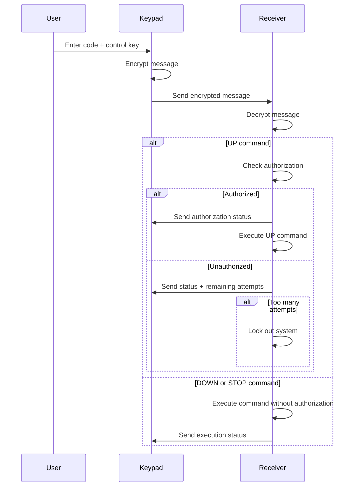

# Touch Keypad

This project is for a general-purpose, capacitive-touch keypad powered by a ESP32 and a matching receiver.

This project was originally designed as a keypad entry system for my garage door, but could easily be modified to other purposes. It is essentially a touch-keypad and receiver pair, where all authorisation is handled by the receier. The keypad only transmits information about what key sequence has been pressed.

## How it works
When the user enters a code on the keypad, the numerical code and the control key (Up, Down, or Stop) are sent as an encrypted message to the receiver. The receiver decrypts the message and determines if the code is correct. It responds with the authorisation status and the number of attempts remaining. If too many unauthorised attempts are made the Receiver locks-out the system.

## How it works

## Keypad PCB Features

- Capacitive touch sensors - simplify assembly
- All components are on the back side
- Prototyping connections Vin, GND, Tx, Rx
- Gerbers pre-generated and LCSC components specified in BOM file

## Receiver PCB Features

- 3ch open-drain outputs
- Wide input voltage
- Pass-through terminals for daisy-chaining other controllers